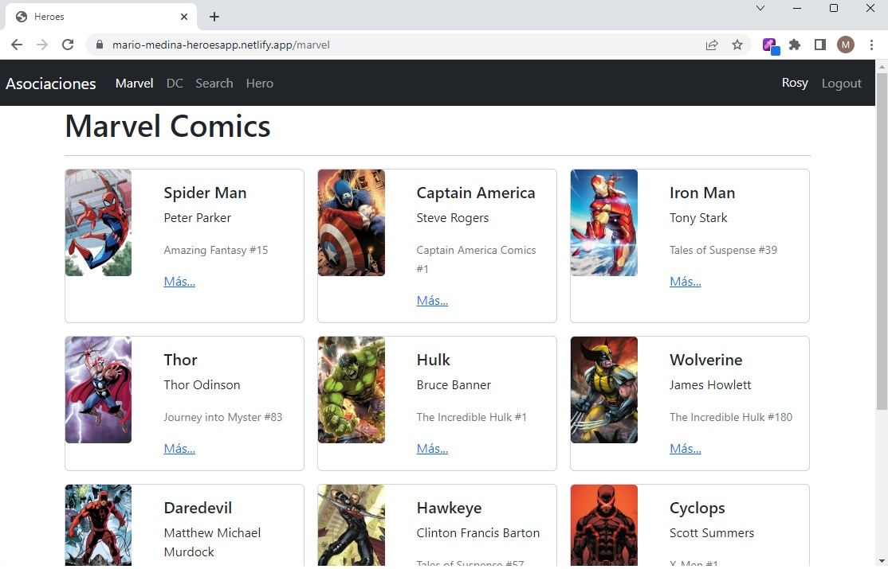

# Guía de inicio rápido: Single Page Application (SPA) + Protección de rutas

Esta guía de inicio rápido demuestra cómo usar Docker Compose para ejecutar una Single Page Application (SPA). Antes de empezar,
[instala Compose](https://docs.docker.com/compose/install/).



### Software utilizado

```
node==18.3
react===18.2.0
vite===4.1.0
query-string===8.1.0
react-router-dom===6.10.0
```

## Deploy con docker compose

```
$ docker compose up -d
```

## Resultados esperados

La lista de contenedores debe mostrar un contenedor en ejecución y la asignación de puertos como se muestra a continuación:
```
$ docker ps
CONTAINER ID   IMAGE                           COMMAND                  CREATED          STATUS                    PORTS                               NAMES
85701f66ccf8   react_django_mysql01-frontend   "docker-entrypoint.s…"   3 minutes ago    Up 3 minutes             0.0.0.0:3000->3000/tcp              docker_react
```

Luego vaya a `http://localhost:3000/` en su navegador web.

Puede ver la SPA en [netlify](https://mario-medina-heroesapp.netlify.app)